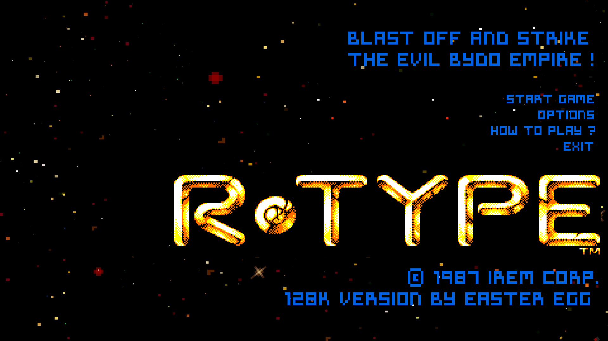
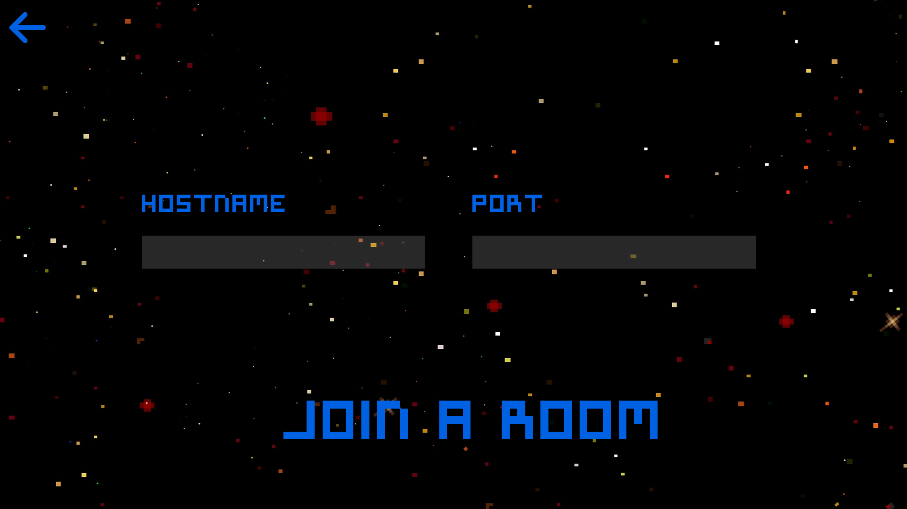
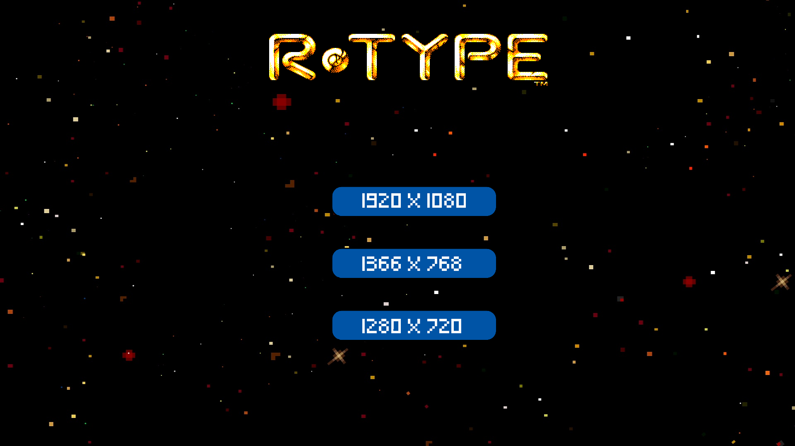
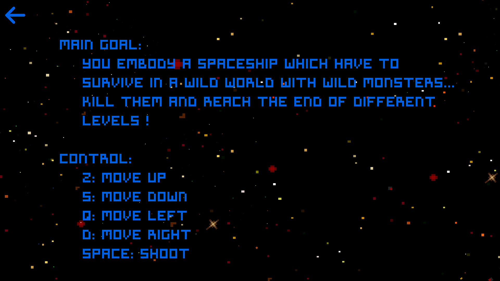

# R-type

## Description

The objective of this project is to create an R-Type conforming to the original born in 1987 on an arcade terminal. It is a series of two dimensional video games emblematic of the horizontal scrolling shoot them up, developed by Irem.

## Usage

### Install

* conan
* sfml

### Launch the project

``` 
$ make add_remotes && make install && make
```

## Gameplay

### Main goal

You embody a spaceship which have to survive in a wild world with wild monsters.                                                                                 Kill them and reach the end of different levels !

### Controls

* Arrow Up: move up
* Arrow Down: move down
* Arrow Left: move left
* Arrow Right: move right
* SPACE: shoot

### Screens

You have a main menu show just below:

<p align="center">
  
</p></br></br>

By clicking on the play button, you'll have to choose between create and join a room which will be the main lobby. See below.

<p align="center">
  
</p></br></br>

This lobby is going to be used to invite or join other players, or to play in single player mode :)

You have a couple of other menus: a "settings" menu and a "how to play" menu.

<p align="center">
  
</p></br></br>

<p align="center">
  ou
</p></br></br>

<p align="center">
  
</p>
